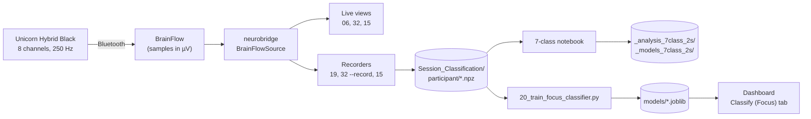

# NeuroBridge: 7-class EEG acquisition and analysis

Real-time EEG acquisition, monitoring and labelled recording for the
**g.tec Unicorn Hybrid Black** (8 channels, 250 Hz), built on the `neurobridge`
Python library, together with an offline analysis notebook and a labelled
dataset from one participant (**PT-003**, two sessions, seven classes).

The seven classes are two eye states and five motor states:

| # | Class | Role |
|---|---|---|
| 1 | Eye Open | eyes-open rest; also the resting baseline for ERD/ERS |
| 2 | Eye Close | eyes-closed rest (posterior alpha) |
| 3 | Clenching Left Hand | motor |
| 4 | Clenching Right Hand | motor |
| 5 | Moving Left Leg | motor |
| 6 | Moving Right Leg | motor |
| 7 | Moving Tongue | motor |

---

## Contents

1. [What you can run, and what it needs](#1-what-you-can-run-and-what-it-needs)
2. [Repository layout](#2-repository-layout)
3. [Requirements](#3-requirements)
4. [Installation](#4-installation)
5. [Part A: the analysis notebook (no headset needed)](#5-part-a-the-analysis-notebook-no-headset-needed)
6. [Part B: the live tools (Unicorn headset needed)](#6-part-b-the-live-tools-unicorn-headset-needed)
7. [The dataset: PT-003](#7-the-dataset-pt-003)
8. [Units: everything is in microvolts](#8-units-everything-is-in-microvolts)
9. [Signal-processing reference](#9-signal-processing-reference)
10. [Results included in this repository](#10-results-included-in-this-repository)
11. [Known limitations](#11-known-limitations)
12. [Troubleshooting](#12-troubleshooting)
13. [Data handling](#13-data-handling)
14. [License](#14-license)

---

## 1. What you can run, and what it needs

| Component | File | Needs the headset? | Operating system |
|---|---|---|---|
| **7-class analysis notebook (QC before/after, ±100 µV epoch screen)** | `examples/EEG_7Class_2s_Classification_Before_After_QC_MI100uV.ipynb` | **No**, runs on the included recordings | Windows, macOS, Linux |
| Classifier training (dashboard model) | `examples/20_train_focus_classifier.py` | **No**, runs on the included recordings | Windows, macOS, Linux |
| Test suite | `tests/` | **No** | Windows, macOS, Linux |
| Live scope | `examples/06_live_scope.py` | Yes | Windows, Linux |
| Unicorn live viewer / recorder | `examples/32_unicorn_live_viewer.py` | Yes | Windows, Linux |
| 7-class recorder (keyboard labels) | `examples/19_record_focus_states.py` | Yes | Windows, Linux |
| Browser dashboard | `examples/15_web_dashboard.py` | Yes | Windows, Linux |

The live tools reach the headset through [BrainFlow](https://brainflow.org).
BrainFlow ships the Unicorn driver for Windows (`Unicorn.dll`) and Linux
(`libunicorn.so`) only, so **live acquisition does not work on macOS**. The
notebook and the training script work on any platform.

**If you only want to read and reproduce the analysis, you only need
[Part A](#5-part-a-the-analysis-notebook-no-headset-needed).**

How the pieces connect:



---

## 2. Repository layout

```text
neurobridge-7class-eeg/
├── README.md                     this file
├── requirements.txt              one-line install of everything below
├── pyproject.toml                package definition for the neurobridge library
├── LICENSE                       BSD 3-Clause
│
├── examples/                     the programs to run
│   ├── EEG_7Class_2s_Classification_Before_After_QC_MI100uV.ipynb   offline analysis (Part A)
│   ├── 06_live_scope.py                  live scope + spectrum + quality
│   ├── 32_unicorn_live_viewer.py         Unicorn-Recorder-style viewer, optional raw recording
│   ├── 19_record_focus_states.py         7-class recorder, keyboard labels
│   ├── 15_web_dashboard.py               browser dashboard (14 tabs)
│   └── 20_train_focus_classifier.py      trains the dashboard's classifier; run by its Train tab
│
├── src/neurobridge/              the library every script imports
│   ├── io/          sources.py (BrainFlow, LSL, synthetic), recording.py (NPZ/CSV format),
│   │                acquisition.py (reader thread)
│   ├── process/     filters.py (causal filters), quality.py (channel quality score),
│   │                dropouts.py (Bluetooth dropout repair), features.py (PSD, band power)
│   ├── core/        ring buffer, montage roles (10-20 labels to functional regions), types
│   ├── viz.py       matplotlib live monitor used by 32
│   └── ...          classify/, transport/, education/ (parts of the wider library, not used here)
│
├── web/dashboard/                page served by 15_web_dashboard.py (index.html, dashboard.js)
├── configs/                      YAML source configs (Unicorn, LSL, Emotiv-over-LSL, synthetic)
├── tests/                        pytest suite, no hardware needed
│
└── Session_Classification/       the data
    ├── registry.jsonl            one line per recorded session
    ├── PT-003/
    │   ├── PT-003_session01_20260916_143852.npz
    │   └── PT-003_session02_20260916_145957.npz
    ├── _analysis_7class_2s/      tables written by the notebook (section 10)
    └── _models_7class_2s/        models written by the notebook (.joblib + .json description)
```

> **Keep this layout.** `15_web_dashboard.py` serves `web/dashboard/` by a path
> relative to itself, and the notebook and scripts look for
> `Session_Classification/` in the repository root.

---

## 3. Requirements

- **Python 3.10 or newer.** Everything here was tested on **Python 3.12.13**,
  which is the recommended version.
- About **1 GB** of free disk space for the Python environment (most of it
  JupyterLab), plus about 10 MB for this repository.
- For Part B only: a **Unicorn Hybrid Black**, charged, and a working
  Bluetooth connection on a **Windows 10/11 or Linux** computer.

Versions used for the tested install (clean virtual environment,
`pip install -r requirements.txt`, September 2026):

| Package | Version |
|---|---|
| Python | 3.12.13 |
| numpy | 2.5.3 |
| scipy | 1.18.1 |
| scikit-learn | 1.9.1 |
| pandas | 3.0.5 |
| matplotlib | 3.11.2 |
| joblib | 1.6.0 |
| PyYAML | 6.0.3 |
| brainflow | 5.23.0 |
| jupyter / notebook / nbconvert / ipykernel | 1.1.1 / 7.6.2 / 7.17.1 / 7.3.0 |
| pytest | 9.1.1 |

The included results were first produced with NumPy 2.5.2 and scikit-learn
1.9.0. Re-running the notebook in the clean environment above reproduced all
seventeen result tables and all four model descriptions (`.json`) **byte for
byte**.

Newer versions should work. The one hard floor is **NumPy 2.0**, because the
notebook uses `np.trapezoid`.

---

## 4. Installation

### 4.1 Get the code

Either click **Code → Download ZIP** on GitHub and unzip it, or clone it:

```bash
git clone <repository-url>
```

> **Windows:** unzip to a **short path** such as `C:\neurobridge-7class-eeg`.
> Under a deeply nested folder, two things can exceed Windows' 260-character
> path limit: installing JupyterLab into `.venv` (which fails with
> `OSError: [WinError 206] The filename or extension is too long`), and the
> notebook saving its result tables (which fails with `FileNotFoundError`).

### 4.2 Create an environment and install

All commands are run **from the repository root** (the folder that contains
`requirements.txt`).

**Windows (PowerShell)**

```powershell
cd C:\neurobridge-7class-eeg
py -3.12 -m venv .venv                 # or: python -m venv .venv
.venv\Scripts\Activate.ps1
python -m pip install --upgrade pip
pip install -r requirements.txt
```

If PowerShell refuses to run `Activate.ps1`, allow it for this window only with
`Set-ExecutionPolicy -Scope Process -ExecutionPolicy Bypass`, then activate
again. In the classic Command Prompt, use `.venv\Scripts\activate.bat` instead.

**macOS / Linux**

```bash
cd ~/neurobridge-7class-eeg
python3 -m venv .venv
source .venv/bin/activate
python -m pip install --upgrade pip
pip install -r requirements.txt
```

**Anaconda / Miniconda (any OS)**

```bash
conda create -n neurobridge python=3.12
conda activate neurobridge
pip install -r requirements.txt
```

`requirements.txt` installs the `neurobridge` library from `src/` in editable
mode (`pip install -e .[brainflow,analysis]`), so any change you make to the
library is picked up without reinstalling. It also installs BrainFlow, the
scientific stack, Jupyter and pytest.

The notebook does not use ICA, so MNE is not needed. Install it
(`pip install mne`) only if you want the MNE conversion shown in 7.3.

### 4.3 Check the install

```bash
pytest
python -c "import neurobridge, brainflow; print('neurobridge', neurobridge.__version__)"
```

On the tested install, `pytest` reports **174 passed** (about 1.5 minutes).
The suite covers
the filters, the recording format, dropout repair, the quality score and a
round trip through BrainFlow's built-in synthetic board. If it passes, any
later problem is with the headset or its connection rather than the software.

---

## 5. Part A: the analysis notebook (no headset needed)

`examples/EEG_7Class_2s_Classification_Before_After_QC_MI100uV.ipynb` runs the
complete offline analysis on the recordings in `Session_Classification/PT-003/`:
data checks, signal quality **before and after preprocessing**, filtering,
2-second epoching with a **±100 µV amplitude screen**, features, ERD/ERS, four
classification tasks, CSP, a permutation test and model export.

What sets this notebook apart:

- **Signal quality is measured twice with the same function:** once on the raw
  recording (*RAW QC*) and once on the preprocessed signal (*PROCESSED QC*).
  A per-channel before/after table shows how much preprocessing changed each
  metric.
- **±100 µV screen, as commonly reported in motor-imagery studies:** for every
  filtered 2 s window, the notebook records whether any channel exceeds
  |EEG| > 100 µV. It reports the share of such windows overall, by class, by
  session and by channel (§8A). The screen is **reported only**: it does not
  remove any window. Rejection still follows the notebook's own rule (§8,
  ±200 µV and the other limits in 5.3).
- **ICA is not used.** Artifacts are handled by filtering, re-referencing and
  rejecting contaminated windows.

### 5.1 Run it

```bash
jupyter lab
```

Open `examples/EEG_7Class_2s_Classification_Before_After_QC_MI100uV.ipynb`,
then choose **Run → Run All Cells**. In VS Code, open the notebook and select
the `.venv` interpreter as the kernel.

To run it without opening a browser, rewriting the saved outputs:

```bash
jupyter nbconvert --to notebook --execute --inplace examples/EEG_7Class_2s_Classification_Before_After_QC_MI100uV.ipynb
```

A full run takes about 2 minutes (135 s on the test machine the first time in
a new environment, faster on later runs) and produces 14 figures.

**No paths need editing.** The first code cell searches upward from the
notebook's folder for `Session_Classification/` and prints what it found
(`Sessions root: ..\Session_Classification`). To analyse recordings stored
elsewhere, replace that call with an explicit path, as the comment in the cell
shows.

### 5.2 What each section does

| § | Section | What it does |
|---|---|---|
| 0 | Configuration | All settings in one cell (see 5.3) |
| 1 | Label harmonisation | Maps spelling variants onto the seven canonical labels |
| 2 | Recording loader | Uses `neurobridge.io.recording.load_recording`, which also repairs Bluetooth dropouts; falls back to plain NumPy if the library is missing |
| 3 | Inventory | Channels, sampling rate, duration, spans and seconds per class |
| 4 | **RAW QC** | The QC panel (below) on each channel of each raw recording, **before** any filtering, plus screening flags |
| 5 | Preprocessing | Median removal, zero-phase 60 Hz notch, zero-phase 1–45 Hz band-pass, common-average reference |
| 6 | **PROCESSED QC** | The same QC panel on the preprocessed signal, its flags, and a **before/after comparison** per channel: % reduction in RMS, SD, robust PTP, mean/median absolute peak, extreme-amplitude fraction, drift and HF ratios, and the drop in mains-band power (dB) |
| 7 | Visual check | Raw vs processed traces (first 8 s of the first recording), PSD before/after, and bar charts of median robust PTP, RMS and median absolute peak per channel, raw vs processed |
| 8 | Epoching | 2 s windows, 1 s step, **inside** each labelled span; every window keeps its span ID; artifact screening per window (decides which windows are kept), plus the ±100 µV screen fields (reported only) |
| 8A | **±100 µV screen** | Share of filtered 2 s windows in which at least one channel exceeds ±100 µV: overall, by class, by session, and per channel, with a bar chart per channel |
| 9 | Features | 25 per channel (time domain, Hjorth, band powers, ratios, spectral entropy) plus 4 C3/C4 lateralisation features: 204 in total |
| 10 | ERD/ERS | Condition-referenced (vs Eye Open) and cue-locked (−1.5 to −0.25 s vs 0.5 to 2.5 s), for alpha/mu and beta |
| 11 | Classification | LDA, logistic regression, RBF-SVM, random forest; feature selection and scaling fitted **inside** each fold; 5-fold `StratifiedGroupKFold` grouped by span |
| 12 | CSP + LDA | Left vs right hand, left vs right leg |
| 13 | Permutation test | Labels shuffled **per span** (25 permutations) to check for leakage |
| 14 | Artifact sensitivity | Artifact metrics, % of windows over ±100 µV, gamma share and RMS by class |
| 15 | Model export | LDA fitted on all windows, per task, saved with its preprocessing settings |
| 16 | Table export | Writes the CSV files listed in 5.4 |
| 17 | Interpretation checklist | What to check before reporting any number |

**The QC panel (§4 and §6).** Each metric is computed per channel over the
whole recording, after subtracting the channel median:

| Metric | Column | Definition |
|---|---|---|
| RMS | `rms_uv` | Root-mean-square amplitude (µV) |
| SD | `std_uv` | Standard deviation (µV) |
| Robust PTP | `robust_ptp_uv` | 99.5th minus 0.5th percentile (µV), the range of the central 99 % of samples |
| Mean / median absolute peak | `mean_abs_peak_uv`, `median_abs_peak_uv` | Magnitude of local positive and negative peaks at least 20 ms apart (µV) |
| Flat fraction | `flat_fraction` | Share of consecutive samples changing by less than 0.01 µV |
| Extreme-amplitude fraction | `extreme_amplitude_fraction` | Share of samples beyond ±`EXTREME_ABS_UV` (500 µV). A descriptive heuristic, **not** a hardware saturation test |
| 60 Hz line ratio | `line_ratio_60hz` | Mean PSD at 59–61 Hz ÷ mean PSD at 55–58 and 62–65 Hz |
| Mains-band power | `mains_band_power_uv2` | Integrated PSD over 55–65 Hz (µV²) |
| Drift ratio | `drift_ratio` | 0.1–1 Hz power ÷ 1–40 Hz power |
| High-frequency ratio | `hf_ratio` | 35–45 Hz power ÷ 1–30 Hz power (muscle indicator) |
| Spectral slope | `spectral_slope` | Theil–Sen slope of log PSD vs log frequency, 2–40 Hz excluding 7–14 Hz |
| SNR proxy | `snr_proxy_db` | 10·log10(1–40 Hz power ÷ 55–65 Hz power). Not a calibrated SNR |

Screening flags: `very_low_amplitude` (RMS < 0.5 µV), `very_high_amplitude`
(RMS > 100 µV), `flat_or_stuck` (flat fraction > 0.2), `extreme_amplitude`
(extreme fraction > 1 %), `mains_peak` (line ratio > 4), `strong_slow_drift`
(drift ratio > 1), `high_HF_or_EMG` (HF ratio > 0.5) and `flat_spectrum`
(slope > −0.3). The notebook's own guidance: use **RAW QC** to describe
acquisition quality, and **PROCESSED QC** to describe the signal passed on to
epoching and classification. See section 10.1 for how to read the processed
numbers on this dataset.

The four classification tasks are:

| Task | Classes | Chance |
|---|---|---|
| `all_7` | all seven | 14.3 % |
| `hand_L_vs_R` | Clenching Left Hand vs Clenching Right Hand | 50 % |
| `leg_L_vs_R` | Moving Left Leg vs Moving Right Leg | 50 % |
| `tongue_vs_eye_states` | Moving Tongue vs Eye Close vs Eye Open | 33.3 % |

### 5.3 Settings you may want to change (first code cell)

| Setting | Default | Meaning |
|---|---|---|
| `PARTICIPANT` | `"PT-003"` | Folder under `Session_Classification/`; `None` analyses every participant folder found |
| `MAINS_HZ` | `60.0` | Mains frequency; use `50.0` for recordings made in 50 Hz countries |
| `L_FREQ`, `H_FREQ` | `1.0`, `45.0` | Band-pass edges (Hz) |
| `APPLY_CAR` | `True` | Common-average reference after filtering |
| `WINDOW_SECONDS`, `STEP_SECONDS` | `2.0`, `1.0` | Epoch length and hop (s) |
| `EXTREME_ABS_UV` | `500.0` | Threshold (µV) for the QC panel's extreme-amplitude fraction. Descriptive only; it does not reject anything |
| `MAX_ABS_UV`, `MAX_PTP_UV`, `MAX_STEP_UV`, `FLAT_STD_UV` | 200, 300, 100, 0.2 | Per-channel artifact limits (µV) on each filtered 2 s window |
| `MAX_BAD_CHANNEL_FRACTION` | `0.25` | A window is rejected if more than this share of channels breaks a limit |
| `MI_ABS_THRESHOLD_UV` | `100.0` | Limit (µV) for the ±100 µV screen in §8/§8A. Reported only; it does not reject windows |

### 5.4 What it writes

Re-running the notebook **overwrites** the copies already included under
`Session_Classification/`.

`Session_Classification/_analysis_7class_2s/`

| File | Contents |
|---|---|
| `recording_inventory.csv` | One row per recording: duration, channels, sampling rate, span count |
| `span_inventory.csv` | One row per labelled span: label, start, end, duration |
| `signal_quality_raw.csv` | RAW QC (§4): the QC panel per channel per recording, with flags |
| `signal_quality_processed.csv` | PROCESSED QC (§6): the same panel on the preprocessed signal, with flags |
| `signal_quality_before_after_comparison.csv` | Raw and processed values side by side (`*_raw`, `*_processed`), `*_reduction_pct` columns and `mains_power_reduction_db` |
| `signal_quality_all_stages.csv` | RAW and PROCESSED rows stacked, with a `stage` column |
| `epoch_artifact_qc.csv` | Every candidate 2 s window with its artifact metrics, the ±100 µV screen fields (`mi_threshold_uv`, `mi_exceeding_channels`, `mi_exceeding_channel_fraction`, `mi_epoch_exceeds_100uv`) and the keep/reject decision |
| `mi_100uv_epoch_qc.csv` | The same per-window table, saved under the ±100 µV name (identical content) |
| `mi_100uv_channel_epoch_qc.csv` | One row per window × channel: largest absolute value (`max_abs_uv`) and whether it exceeds ±100 µV |
| `mi_100uv_summary_by_class.csv` | Per class: windows, windows over ±100 µV and their %, median/max channels over, median and 95th percentile of the window maximum |
| `mi_100uv_summary_by_session.csv` | The same per participant/session |
| `mi_100uv_summary_by_channel.csv` | Per channel: % of windows in which that channel exceeds ±100 µV, median and 95th percentile of its window maximum |
| `epoch_features_2s.csv` | Feature matrix (one row per kept window) |
| `erds_condition_reference.csv` | ERD/ERS (%) per class, band and channel, vs Eye Open |
| `erds_cue_locked.csv` | ERD/ERS (%) per event, band and channel, pre-cue vs post-cue |
| `classification_grouped_cv_summary.csv` | Balanced accuracy and macro-F1 (mean ± SD over folds) per task and model |
| `permutation_sanity_check.csv` | Observed vs span-permuted balanced accuracy, approximate p-value |

`Session_Classification/_models_7class_2s/` holds one `<task>_LDA_2s.joblib`
per task (the fitted scikit-learn pipeline plus its settings) and a matching
`.json` that describes it in plain text: classes, feature order, channel
order, sampling rate, filter and artifact thresholds (including the ±100 µV
screen limit, recorded as `mi_comparison_abs_threshold_uv`).

```python
import joblib
bundle = joblib.load("Session_Classification/_models_7class_2s/hand_L_vs_R_LDA_2s.joblib")
bundle["pipeline"], bundle["classes"], bundle["feature_columns"][:5]
```

> A `.joblib` file is a Python pickle. Only load files from a source you trust.
> Loading one with a different scikit-learn version may raise an
> `InconsistentVersionWarning`; re-run the notebook to regenerate the models
> under your own version.

---

## 6. Part B: the live tools (Unicorn headset needed)

### 6.1 Before connecting

1. **Charge and switch on** the headset. Pair it in the operating system's
   Bluetooth settings if it has not been paired with this computer before.
2. Note its **serial number**, printed on the device in the form
   `UN-YYYY.MM.NN`. The commands below use `UN-2022.04.52` as an example;
   replace it with your own.
3. **Close Unicorn Suite / Unicorn Recorder.** The headset streams to one
   program at a time.
4. Keep the Bluetooth adapter **close to the headset**. Lost packets show up in
   the status lines as "held" samples (see 9.3).
5. In a 50 Hz country, add **`--mains 50`** to every command. It sets the notch
   filter, the quality score and the dropout repair.
6. Run every command **from the repository root** with the environment active.
   Every script also accepts `--help`.

Options shared by the live scripts:

| Option | Meaning |
|---|---|
| `--board UNICORN_BOARD` | BrainFlow board name (32 uses this by default) |
| `--serial-number UN-...` | Which Unicorn to connect to |
| `--serial-port COM3` | Only for boards that connect through a serial port (not the Unicorn) |
| `--mains 60` / `--mains 50` | Mains frequency |
| `--config configs/<file>.yaml` | Build the source from a YAML file instead (06, 15, 19), e.g. `configs/alpha_attention_unicorn.yaml`, or `configs/alpha_attention_lsl.yaml` for any EEG stream on Lab Streaming Layer |

### 6.2 `06_live_scope.py`: live scope, spectrum and signal quality

```bash
python examples/06_live_scope.py --board UNICORN_BOARD --serial-number UN-2022.04.52
```

One window, three panels:

- **Traces:** all 8 channels, 1–45 Hz band-pass and notch (causal), stacked
  `--scale` µV apart, with a 20 µV scale bar. Each channel name is coloured
  green or red by its quality score. The status line gives the mean score, how
  many channels are usable, advice for the worst channel, and the Bluetooth
  loss when it reaches 1 %.
- **Spectrum:** Welch PSD of one posterior channel (µV²/Hz, log–log), with the
  8–13 Hz alpha band shaded. When the participant closes their eyes, a peak
  near 10 Hz should appear within a second or two. This is the quickest check
  that the headset is picking up brain activity.
- **Band bar:** relative delta/theta/alpha/beta/gamma power on that channel.

| Option | Default | Effect |
|---|---|---|
| `--seconds` | 5 | Width of the time window |
| `--scale` | 50 | µV between channel baselines |
| `--spectrum-channel` | posterior | e.g. `Oz` |
| `--raw` | off | Show unfiltered samples (drift, blinks, mains hum) |
| `--save out.png` | off | Render one frame to a PNG and exit |

> **Without `--board` or `--config`, this script does not connect to a
> headset.** It runs neurobridge's synthetic signal generator instead (see 6.7).

### 6.3 `32_unicorn_live_viewer.py`: Unicorn-Recorder-style viewer and raw recorder

```bash
python examples/32_unicorn_live_viewer.py --serial-number UN-2022.04.52
python examples/32_unicorn_live_viewer.py --serial-number UN-2022.04.52 --record recordings/viewer_01.npz
```

- Display settings match Unicorn Recorder's defaults: one axis per channel,
  fixed ±50 µV, 0.1–30 Hz band-pass with a 60 Hz notch, 8 s window, every
  sample drawn. There is no OSCAR artifact filter, so traces will not look
  identical to Unicorn Recorder with OSCAR on.
- Beside each trace: **% of samples outside the view** and **peak-to-peak (µV)**
  of the window, so a large artifact is never hidden just because it left the
  axis.
- A **Good/Bad badge** per channel from the quality score, computed once a
  second on a separate 1–45 Hz copy of the last 5 s. Good/Bad is not an
  impedance measurement, and "Good" does not mean the window is free of
  artifacts. Read it together with the peak-to-peak value.
- Status line: "filter settling" for the first max(8 s, 5 / low cut-off),
  **NO RECENT DATA** after 2 s without samples, the Bluetooth held-sample rate
  over the last 10 s, and packet-counter gaps.
- Acquisition runs on its own thread, so a busy window never stalls reading or
  recording.
- `--record <path>.npz` saves **unfiltered EEG exactly as delivered** (no
  dropout repair), with BrainFlow's timestamp, packet counter and marker rows.
  While recording, each chunk is appended to a `.csv` and flushed immediately.
  The `.npz` and a `.json` description are written on close. Existing files are
  never overwritten. Length is capped by `--max-minutes` (default 60).

| Option | Default | Effect |
|---|---|---|
| `--low`, `--high` | 0.1, 30 | Display band-pass (Hz) |
| `--notch` | 60 | Display notch; `0` for none |
| `--scale` | 50 | Fixed half-range per axis (µV) |
| `--window` | 8 | Seconds on screen |
| `--raw` | off | Samples as delivered, median-centred for display only |
| `--save out.png`, `--save-after 10` | off | Run headless, save one frame, exit |

### 6.4 `19_record_focus_states.py`: 7-class recording with keyboard labels

```bash
python examples/19_record_focus_states.py --participant PT-004 --board UNICORN_BOARD --serial-number UN-2022.04.52
```

1. A live trace window opens (0.5–50 Hz + notch, 5 s) with a quality line.
2. **Click the plot window** so it has keyboard focus.
3. Press a label key once to **start** a span, and press the **same key** again
   to **end** it. Only one span can be open at a time.
4. Press **`q`** to stop. The recording is also saved if the window is closed
   some other way.

| Key | Label |
|---|---|
| `o` | Eye Open |
| `c` | Eye Close |
| `1` | Clenching Left Hand |
| `2` | Clenching Right Hand |
| `3` | Moving Left Leg |
| `4` | Moving Right Leg |
| `5` | Moving Tongue |
| `q` | quit and save |

Output: `Session_Classification/<participant>/<participant>_sessionNN_<YYYYMMDD_HHMMSS>.npz`,
plus one line appended to `Session_Classification/registry.jsonl`. You never
type the session number. It continues from the files already in the
participant's folder, so a new PT-003 recording would become `session03`.

- `--participant` must be a **pseudonymous code** (2–4 capital letters, a dash,
  3–5 digits, e.g. `PT-004`). The script refuses anything else, so a real name
  cannot end up in a file name.
- This script refuses to run without `--board` or `--config`.
- `--max-minutes` (default 30) caps the recording length.
- This recorder uses the source's built-in dropout repair, so the saved samples
  have Bluetooth dropouts already filled (see 9.3).
- Span times are measured on the computer clock (see [Known limitations](#11-known-limitations)).

The script's own notes caution about the two leg classes. The leg area of motor
cortex lies on the medial wall near the vertex, so on this montage left and
right leg both project mainly to Cz. Left vs right hand, and limbs vs tongue,
are the contrasts an 8-channel dry montage can realistically separate. Left vs
right leg may not separate at all.

### 6.5 `15_web_dashboard.py`: browser dashboard

```bash
python examples/15_web_dashboard.py --board UNICORN_BOARD --serial-number UN-2022.04.52
```

Then open **<http://127.0.0.1:8090/index.html>** in a browser. Stop with
**Ctrl+C** in the terminal; any recording in progress is saved first.

The page talks only to this Python process, over plain HTTP. It cannot connect
or disconnect the headset. The header shows `live (BrainFlowSource)` when a
headset is connected.

| Tab | What it shows / does |
|---|---|
| Scope | Live traces, spectrum of a selectable channel, relative band power |
| Focus game | Neurofeedback game driven by frontal engagement, beta / (alpha + theta), relative to its first 8 s |
| Bands | One channel split into delta, theta, alpha, beta and gamma |
| ICA / artifacts | FastICA refitted every `--refit` s; filtered vs cleaned traces with blink/muscle components removed |
| Time-domain | RMS, mean absolute deviation, zero-crossing rate per channel |
| Frequency-domain | Spectral entropy over time |
| Synchronicity | Coherence and phase-locking value matrices per band |
| Topomap | Scalp map of relative band power from the 10-20 channel labels |
| Record & label | Short recording to `sessions/web_*.npz` with artifact labels (blink, saccade, jaw clench, muscle, clean) |
| Validate | Checks the ICA artifact heuristic against a labelled recording |
| Record (Focus) | Same seven classes, file layout and registry as `19_record_focus_states.py`; labels by button |
| **Record (7-class)** | Same seven classes and layout, but each label is written into the headset's **marker row**, so span boundaries fall on exact samples. EEG is saved unfiltered with no dropout repair, and the CSV is flushed every chunk (a crashed session can be rebuilt with `neurobridge.io.recording.recover_csv_recording`) |
| Train (Focus) | Runs `20_train_focus_classifier.py` (unchanged) and shows its log |
| Classify (Focus) | Loads a model from the Train tab and classifies live windows |

The **Record (7-class)** tab gives the most precise labels of any recorder here
and is the recommended way to record new sessions.

| Option | Default | Effect |
|---|---|---|
| `--port` | 8090 | HTTP port for page and API |
| `--host` | 127.0.0.1 | Listen address (this computer only) |
| `--display-low` | 0.5 | High-pass for the **displayed** trace only; `1.0` removes most slow electrode drift. Recordings are never filtered |
| `--scale` | 50 | µV between channel baselines (Scope and Record tabs) |
| `--quality-window` | 5 | Seconds scored by the quality check (1–45 Hz copy) |
| `--four-low`, `--four-high`, `--four-notch`, `--four-scale`, `--four-window` | 0.1, 30, 60, 50, 8 | Display settings of the Record (7-class) tab (the `four` prefix is historical) |
| `--four-max-minutes` | 30 | Recording cap for the Record (7-class) tab |
| `--sessions-root` | `Session_Classification` | Where participant recordings go |
| `--window`, `--refit` | 4, 0.5 | Seconds of data used by, and refit interval (s) of, the ICA and connectivity tabs |
| `--calibrate`, `--focus-refit` | 20, 1 | Classify tab: seconds of baseline, seconds between predictions |
| `--allow-simulated` | off | See 6.7 |

Code comments in this script refer to other scripts from the wider project
(`07`–`14`, `16`–`18`, `21`, `33`), to explain where each piece of logic came
from. The dashboard has its own copy of that logic and does not need those
files. The only script it runs is `20_train_focus_classifier.py`.

### 6.6 `20_train_focus_classifier.py`: train the dashboard's classifier

```bash
python examples/20_train_focus_classifier.py --sessions-root Session_Classification --out models/focus_classifier.joblib
```

This script needs no headset. It reads every
`Session_Classification/<participant>/*.npz` and trains on **every label
present**, which for PT-003 means all seven classes. Its opening docstring
still describes the older four-class protocol, but the code has no fixed class
list.

Pipeline:
- 0.5–50 Hz band-pass and notch; 4 s windows with a 1 s hop inside each span;
  FastICA artifact removal on each window.
- 15 features: posterior and frontal band power, engagement ratios, spectral
  entropy, amplitude, zero-crossing rate, and frontal–posterior alpha coherence
  and PLV. Features are z-scored within each participant.
- Five models (logistic regression, LDA, RBF-SVM, random forest, MLP), compared
  by macro-F1.
- Leave-one-participant-out cross-validation when at least two participants are
  present, span-grouped cross-validation otherwise (the case with PT-003
  alone).
- The best model is saved in the format the dashboard's **Classify (Focus)**
  tab loads.

As the script's own notes say, none of these 15 features is lateralised (each
averages over a whole frontal or posterior group), so left-vs-right contrasts
are expected to be its weakest.

Tested on the included PT-003 data (about 2 minutes; the many FastICA
`ConvergenceWarning` lines it prints are expected). It used 205 windows from
84 spans and 5-fold span-grouped cross-validation, and all seven classes
together:

| Model | Macro-F1 (mean ± SD) |
|---|---|
| LDA (selected and saved) | 0.174 ± 0.042 |
| MLP | 0.171 ± 0.033 |
| Random forest | 0.151 ± 0.046 |
| Logistic regression | 0.150 ± 0.089 |
| RBF-SVM | 0.125 ± 0.058 |

For seven balanced classes, chance macro-F1 is about 0.14. Its per-recording
quality line reported 7/8 usable channels for session 01 (C3: mains
interference) and 8/8 for session 02, on the middle 2 s of each file.

### 6.7 Running the live tools without a headset (software check only)

Three tools can run on a **synthetic signal generator**, to check the install or
look at the interface without hardware. **Nothing they show is EEG.** Do not use
them to judge signal quality, alpha, ERD/ERS or classifier behaviour.

| Command | What happens |
|---|---|
| `python examples/06_live_scope.py` | No `--board` → neurobridge `SyntheticSource` |
| `python examples/32_unicorn_live_viewer.py --demo` | `SyntheticSource` |
| `python examples/15_web_dashboard.py --config configs/alpha_attention.yaml --allow-simulated` | Synthetic source; the page shows a red **SIMULATED DATA** banner |

Without `--allow-simulated`, the dashboard refuses to start on anything other
than a live headset source (BrainFlow or LSL). `19_record_focus_states.py` has
no simulated mode.

---

## 7. The dataset: PT-003

### 7.1 Overview

| | |
|---|---|
| Participant | PT-003 (pseudonymous code) |
| Headset | g.tec Unicorn Hybrid Black |
| Channels | 8 EEG: **Fz, C3, Cz, C4, Pz, PO7, Oz, PO8** (10-20 labels) |
| Sampling rate | 250 Hz |
| Unit | µV (float32), unfiltered |
| Date | 16 September 2026, two consecutive sessions |
| Recorder | The 7-class keyboard/button recorder: `19_record_focus_states.py`, or the dashboard's Record (Focus) tab, which writes the identical format. Spans are timed by the computer clock |
| Mains | 60 Hz |

| Session | File | Duration | Samples | Labelled spans | Held (lost) samples |
|---|---|---|---|---|---|
| 01 | `PT-003_session01_20260916_143852.npz` | 541.2 s | 135,295 | 41 | 0.01 % |
| 02 | `PT-003_session02_20260916_145957.npz` | 549.8 s | 137,446 | 43 | 0.00 % |

Spans per class:

| Class | Session 01 | Session 02 | Total |
|---|---|---|---|
| Eye Open | 6 | 6 | 12 |
| Eye Close | 5 | 7 | 12 |
| Clenching Left Hand | 6 | 6 | 12 |
| Clenching Right Hand | 6 | 6 | 12 |
| Moving Left Leg | 6 | 6 | 12 |
| Moving Right Leg | 6 | 6 | 12 |
| Moving Tongue | 6 | 6 | 12 |
| **Total** | **41** | **43** | **84** |

Spans last 3.5–15.6 s (median 6.2 s) in session 01 and 0.5–8.8 s (median
6.1 s) in session 02. The 0.5 s span is shorter than one 2 s window, so the
notebook uses 83 of the 84 spans.

### 7.2 File format

Each `.npz` is a compressed NumPy archive:

| Key | Shape | Contents |
|---|---|---|
| `data` | (8, n_samples), float32 | EEG in µV, channel order as `meta["ch_names"]`, **unfiltered** |
| `chunk_starts` | (n_chunks,), float64 | Host-clock time (s, arbitrary origin) of the first sample of each chunk as it arrived |
| `meta` | 0-d string | JSON: `device`, `sfreq`, `ch_names`, `ch_types`, `unit`, `n_samples`, `truncated`, `annotations` |

Each entry in `meta["annotations"]` is one labelled span:

```json
{"label": "Clenching Left Hand", "t_start": 52.66, "t_end": 56.13, "participant": "PT-003", "session": 1}
```

`t_start` and `t_end` are seconds from the start of the recording, so a span
covers samples `round(t_start * 250)` to `round(t_end * 250)`.

Files recorded with `32 --record` or the dashboard's **Record (7-class)** tab
contain more: `timestamps`, `package_num` and `marker` arrays, a `packet_loss`
summary in `meta`, and an exact `start_sample` / `end_sample` for every span.

### 7.3 Loading a recording

With the library (this also repairs Bluetooth dropouts the same way the live
system does):

```python
from neurobridge.io.recording import load_recording

data, device, meta = load_recording(
    "Session_Classification/PT-003/PT-003_session01_20260916_143852.npz")
print(data.shape, device.sfreq, device.ch_names, device.unit)   # (8, 135295) 250.0 (...) uV
for span in meta["annotations"][:3]:
    print(span["label"], span["t_start"], span["t_end"])
```

With NumPy only:

```python
import json
import numpy as np

z = np.load("Session_Classification/PT-003/PT-003_session01_20260916_143852.npz")
meta = json.loads(str(z["meta"]))
data = z["data"].astype(float)          # µV, shape (8, n_samples)
```

In MNE-Python (`pip install mne`), with the conversion to volts done for you:

```python
from neurobridge.io.recording import load_recording, to_mne
data, device, meta = load_recording("Session_Classification/PT-003/PT-003_session01_20260916_143852.npz")
raw = to_mne(data, device)              # µV → V, standard_1020 montage attached
```

`Session_Classification/registry.jsonl` has one JSON line per session:
participant, session number, path, UTC timestamp and span counts per label.

---

## 8. Units: everything is in microvolts

- BrainFlow delivers Unicorn EEG in **µV**. neurobridge never rescales the
  samples: it stores them in µV and labels them `"unit": "uV"`. neurobridge
  sets that label itself; it is not read from the device.
- Every amplitude on screen and in the tables is therefore in µV: traces,
  scale bars, peak-to-peak readouts, RMS, artifact thresholds, and PSDs in
  µV²/Hz.
- The only conversion is in `neurobridge.io.recording.to_mne`, which multiplies
  by 1e-6 because MNE expects volts.
- **The saved files are unfiltered**, so every channel includes a large
  constant offset and slow drift. In the two PT-003 sessions the per-channel
  median lies between about **168,000 and 445,000 µV** (168–445 mV), and the
  signal varies around it by tens of millivolts. These values come from the
  missing filtering, not from a unit error. **Filter before reading
  amplitudes.** The drift and a large jump at the start of each recording are
  why the notebook's RAW QC (§4) flags every channel as `very_high_amplitude`,
  `extreme_amplitude`, `mains_peak` and `strong_slow_drift`. Inside the
  labelled spans, the filtered signal is 5–18 µV RMS, and every 2 s window
  passes the µV-level artifact limits in §8 (sections 10.1 and 10.2).

---

## 9. Signal-processing reference

### 9.1 Live path, per tool

| Tool | Displayed signal | Quality score computed on | What is saved |
|---|---|---|---|
| `06_live_scope.py` | 1–45 Hz + notch, causal (`--raw`: unfiltered) | The displayed window (5 s) | Nothing |
| `32_unicorn_live_viewer.py` | 0.1–30 Hz + notch, causal | Separate 1–45 Hz copy, last 5 s | `--record`: unfiltered, no dropout repair, plus timestamp/counter/marker |
| `19_record_focus_states.py` | 0.5–50 Hz + notch, causal | The displayed window (5 s) | Unfiltered, **dropouts repaired**, spans timed by the computer clock |
| `15_web_dashboard.py` | Per tab (0.5–50 Hz by default; 0.1–30 Hz on Record (7-class)) | Separate 1–45 Hz copy, last `--quality-window` s | Unfiltered, no dropout repair; marker-row spans on Record (7-class) |

All live filters are **causal**: a 4th-order Butterworth band-pass in
second-order sections, plus an IIR notch (Q = 30) at the mains frequency and
any harmonics below 95 % of Nyquist (at 250 Hz, that is 60 Hz only). They run
once over the stream and carry their state from chunk to chunk, so overlapping
windows are never re-filtered.

### 9.2 The channel quality score

`neurobridge.process.quality.QualityMonitor` scores each channel from 0 to 1.
The score is the geometric mean of three sub-scores, so one very bad metric
pulls the whole score down:

| Sub-score | Full marks | Falls to zero at |
|---|---|---|
| RMS amplitude | 3–45 µV | 0.5 µV or 120 µV |
| Residual mains (mains RMS ÷ 1–45 Hz RMS, all harmonics) | ≤ 0.2 | 0.6 |
| 1/f spectral slope (2–24 Hz excluding 7–14 Hz, Theil–Sen fit) | −2.5 to −0.7 | −4.0 or +0.3 |

A channel scores 0 outright if it is **flat** (RMS < 0.1 µV) or **saturated**
(more than 1 % of samples at or beyond ±500 µV). A channel counts as
**usable / Good** if its score is at least 0.5. The score checks whether the
signal looks physiological. It is **not an electrode impedance measurement**.

### 9.3 Bluetooth dropout repair

When Unicorn packets are lost over Bluetooth, BrainFlow repeats the last sample
for the length of the gap, so the sample count and timing stay correct. Raw
dry-electrode data carries a large mains component, so a frozen sample leaves a
step as large as the hum. After filtering, that step becomes a transient of
hundreds of µV.

`neurobridge.process.dropouts.DropoutRepair` fixes this:
- It replaces each held run with the last good sample plus the mains
  oscillation carried on through the gap (the fundamental and 2nd harmonic,
  fitted with a linear trend on the good data just before the gap).
- Samples that were not lost are returned bit-for-bit.
- `load_recording()` applies the same repair when it loads a file, so offline
  analysis sees what the live system sees.

The EEG inside a gap is still lost. If more than a few percent of samples are
held, move the Bluetooth adapter closer to the headset.

### 9.4 Offline path (the notebook)

1. **RAW QC** on each whole recording.
2. Interpolate any non-finite samples; subtract each channel's median.
3. 60 Hz IIR notch (Q = 30), **zero-phase** (`filtfilt`).
4. 4th-order Butterworth band-pass 1–45 Hz, **zero-phase** (`sosfiltfilt`),
   over the whole continuous recording.
5. Common-average reference.
6. **PROCESSED QC** on each whole recording, and the before/after comparison.
7. 2 s windows, 1 s hop, only fully inside a labelled span; each window keeps
   its span ID.
8. Reject a window if more than 25 % of channels have |x| > 200 µV,
   peak-to-peak > 300 µV, a sample-to-sample step > 100 µV, or SD < 0.2 µV.
   Separately, record whether any channel exceeds ±100 µV (the §8A screen,
   which does not affect rejection).
9. Compute features, then classify. `SelectKBest(k=40)` and `StandardScaler`
   are fitted **inside each training fold**. Evaluation uses 5-fold
   `StratifiedGroupKFold` grouped by span, so overlapping windows from one span
   never appear in both training and test data.

The notebook applies no ICA at any stage. The ICA used by the dashboard and
`20_train_focus_classifier.py` belongs to those tools and does not affect the
notebook.

---

## 10. Results included in this repository

These are the notebook outputs included in
`Session_Classification/_analysis_7class_2s/`, produced from exactly the code
and data in this repository.

### 10.1 Signal quality before and after preprocessing

From `signal_quality_raw.csv`, `signal_quality_processed.csv` and
`signal_quality_before_after_comparison.csv`: 8 channels × 2 sessions = 16 rows
each. All values are medians over the 16 rows.

| Metric | RAW | PROCESSED | Median per-channel change |
|---|---|---|---|
| RMS (µV) | 37,607 | 5,793 | −85.7 % |
| SD (µV) | 36,771 | 5,793 | −85.4 % |
| Robust PTP (µV) | 187,899 | 727 | −99.7 % |
| Mean absolute peak (µV) | 19,588 | 62.5 | −99.6 % |
| Median absolute peak (µV) | 11,638 | 5.3 | −99.95 % |
| Extreme-amplitude fraction (beyond ±500 µV) | 0.967 | 0.008 | −99.2 % |
| 60 Hz line ratio | 1,919 | 18.6 | |
| Mains-band power, 55–65 Hz (µV²) | 14,415 | 0.025 | −58.5 dB (range −41.8 to −65.4 dB) |
| Drift ratio | 54.2 | 0.78 | −98.4 % |
| High-frequency ratio | 0.0016 | 0.000014 | −99.2 % |
| Spectral slope | −2.47 | −3.83 | |
| SNR proxy (dB) | 9.1 | 64.0 | |

Flags on the 16 channel-sessions:

| Flag | RAW | PROCESSED |
|---|---|---|
| `very_high_amplitude` | 16 | 16 |
| `extreme_amplitude` | 16 | 4 |
| `mains_peak` | 16 | 14 |
| `strong_slow_drift` | 16 | 7 |

**Reading the PROCESSED numbers: the start of each recording dominates them.**
The notebook computes QC over each *whole* recording. Each recording begins
with a very large jump:
- in the first 0.06 s, raw sample-to-sample steps reach about 1,060,000 µV,
  and no step larger than 50,000 µV occurs anywhere later;
- the level in the first second is 110,000–510,000 µV away from the channel
  median.

Zero-phase filtering spreads that jump into a transient of up to 758,566 µV
(session 01, first 6.9 s) and 1,571,700 µV (session 02, first 3.0 s). That
transient accounts for the thousands of µV in processed RMS and for most of
the processed flags.

A separate check, using the notebook's preprocessing but not produced by the
notebook, shows what the classifier actually receives. Ranges are across the
8 channels:

| Processed signal | Session 01 | Session 02 |
|---|---|---|
| RMS, whole recording (as in the notebook) | 1,019–4,871 µV | 6,715–14,305 µV |
| RMS, first and last 5 s excluded | 28–113 µV | 37–110 µV |
| RMS, **inside labelled spans only** | **5.1–10.0 µV** | **5.6–17.9 µV** |
| Samples beyond ±500 µV (any channel) | 2.07 % of the recording, **none inside a span** | 1.96 %, **none inside a span** |
| Drift ratio, first and last 5 s excluded | 0.01–0.04 | 0.01–0.03 |
| 60 Hz line ratio, first and last 5 s excluded | 0.2–7.5 | 1.1–7.0 |

In summary:
- **Inside the labelled spans**, where every 2 s window comes from, the
  filtered signal is in the normal EEG amplitude range. The first span starts
  about 53 s (session 01) and 61 s (session 02) into the recording, well after
  the transient. Shorter excursions above 500 µV (up to about 4,700 µV) also
  occur, but only between spans.
- **Without the edges, no channel would be flagged for drift**, and only 4 of
  the 16 channel-sessions would keep `mains_peak`. In any case, that ratio
  compares bands at 55–65 Hz, all above the 45 Hz low-pass cut-off, while the
  absolute mains-band power fell by 41.8–65.4 dB.
- **The RAW QC stands as a description of acquisition quality.** It shows
  large offsets, drift, strong 60 Hz pickup, and a large jump at the start of
  each recording.
- **The §7 trace plot shows the first 8 s of session 01, which is exactly the
  transient.** For a representative view, add a cell with
  `plot_raw_vs_processed(RECORDINGS[0], seconds=8, start_s=60)`.

### 10.2 Windows

The 83 usable spans gave 411 candidate 2 s windows. **All 411 passed** the
artifact limits, so none were rejected.

| Class | Windows |
|---|---|
| Eye Open | 76 |
| Eye Close | 68 |
| Clenching Left Hand | 51 |
| Clenching Right Hand | 65 |
| Moving Left Leg | 47 |
| Moving Right Leg | 58 |
| Moving Tongue | 46 |

### 10.3 ±100 µV epoch screen (§8A)

From the `mi_100uv_*.csv` files. **8 of the 411 filtered 2 s windows (1.95 %)**
have at least one channel beyond ±100 µV. Each of those 8 windows has exactly
one such channel. The largest absolute value in any window is 131 µV, below
the notebook's ±200 µV rejection limit, so all 411 windows are still used.

| Class | Windows | Over ±100 µV | % | Median window max (µV) | 95th percentile (µV) |
|---|---|---|---|---|---|
| Eye Open | 76 | 3 | 3.9 | 36.0 | 75.2 |
| Eye Close | 68 | 0 | 0.0 | 33.7 | 52.9 |
| Clenching Left Hand | 51 | 2 | 3.9 | 33.1 | 61.5 |
| Clenching Right Hand | 65 | 0 | 0.0 | 35.5 | 53.6 |
| Moving Left Leg | 47 | 1 | 2.1 | 35.5 | 59.2 |
| Moving Right Leg | 58 | 2 | 3.4 | 35.9 | 63.3 |
| Moving Tongue | 46 | 0 | 0.0 | 33.4 | 51.5 |

| Session | Windows | Over ±100 µV | % | Median window max (µV) | 95th percentile (µV) |
|---|---|---|---|---|---|
| 01 | 209 | 2 | 0.96 | 34.7 | 53.6 |
| 02 | 202 | 6 | 2.97 | 35.6 | 67.9 |

| Channel | Fz | C3 | Cz | C4 | Pz | PO7 | Oz | PO8 |
|---|---|---|---|---|---|---|---|---|
| Windows over ±100 µV (of 411) | 0 | 3 | 0 | 5 | 0 | 0 | 0 | 0 |
| % | 0.0 | 0.73 | 0.0 | 1.22 | 0.0 | 0.0 | 0.0 | 0.0 |
| Median window max (µV) | 22.4 | 21.4 | 21.6 | 29.1 | 18.5 | 14.0 | 20.3 | 14.1 |

By this criterion, amplitude contamination inside the labelled spans is low.
The only exceedances are single-channel events on the two lateral motor
electrodes, C3 and C4. These are the channels that matter most for the
left/right motor contrasts, so those windows are worth a look. With only 8
windows involved, they cannot explain the chance-level classification in
10.6.

### 10.4 Grouped cross-validation (5 folds, mean ± SD across folds)

| Task (chance) | Model | Windows | Spans | Balanced accuracy | Macro-F1 |
|---|---|---|---|---|---|
| `all_7` (14.3 %) | LDA | 411 | 83 | 0.108 ± 0.045 | 0.100 ± 0.042 |
| `all_7` (14.3 %) | LogisticRegression | 411 | 83 | 0.113 ± 0.046 | 0.110 ± 0.042 |
| `all_7` (14.3 %) | SVM_RBF | 411 | 83 | 0.094 ± 0.054 | 0.092 ± 0.050 |
| `all_7` (14.3 %) | RandomForest | 411 | 83 | 0.112 ± 0.050 | 0.099 ± 0.042 |
| `hand_L_vs_R` (50 %) | LDA | 116 | 24 | 0.442 ± 0.038 | 0.428 ± 0.040 |
| `hand_L_vs_R` (50 %) | LogisticRegression | 116 | 24 | 0.498 ± 0.076 | 0.483 ± 0.084 |
| `hand_L_vs_R` (50 %) | SVM_RBF | 116 | 24 | 0.330 ± 0.152 | 0.311 ± 0.150 |
| `hand_L_vs_R` (50 %) | RandomForest | 116 | 24 | 0.403 ± 0.176 | 0.387 ± 0.180 |
| `leg_L_vs_R` (50 %) | LDA | 105 | 24 | 0.490 ± 0.101 | 0.482 ± 0.105 |
| `leg_L_vs_R` (50 %) | LogisticRegression | 105 | 24 | 0.480 ± 0.074 | 0.472 ± 0.079 |
| `leg_L_vs_R` (50 %) | SVM_RBF | 105 | 24 | 0.478 ± 0.055 | 0.467 ± 0.052 |
| `leg_L_vs_R` (50 %) | RandomForest | 105 | 24 | 0.516 ± 0.043 | 0.496 ± 0.067 |
| `tongue_vs_eye_states` (33.3 %) | LDA | 190 | 35 | 0.332 ± 0.024 | 0.315 ± 0.028 |
| `tongue_vs_eye_states` (33.3 %) | LogisticRegression | 190 | 35 | 0.295 ± 0.046 | 0.277 ± 0.039 |
| `tongue_vs_eye_states` (33.3 %) | SVM_RBF | 190 | 35 | 0.368 ± 0.095 | 0.356 ± 0.094 |
| `tongue_vs_eye_states` (33.3 %) | RandomForest | 190 | 35 | 0.326 ± 0.048 | 0.311 ± 0.045 |

The CSP + LDA results for the two left/right tasks are in the notebook
(§12).

### 10.5 Span-level permutation test (LDA, 25 permutations)

| Task | Observed | Label-shuffled (mean ± SD) | Chance | p (approx.) |
|---|---|---|---|---|
| `all_7` | 0.108 | 0.140 ± 0.036 | 0.143 | 0.81 |
| `hand_L_vs_R` | 0.442 | 0.511 ± 0.106 | 0.500 | 0.77 |
| `leg_L_vs_R` | 0.490 | 0.502 ± 0.124 | 0.500 | 0.58 |
| `tongue_vs_eye_states` | 0.332 | 0.306 ± 0.071 | 0.333 | 0.46 |

### 10.6 How to read the classification results

**No task is classified above chance.** The best balanced accuracy for each
task is:

| Task | Best balanced accuracy | Model | Chance |
|---|---|---|---|
| `all_7` | 0.113 | logistic regression | 0.143 |
| `hand_L_vs_R` | 0.498 | logistic regression | 0.500 |
| `leg_L_vs_R` | 0.516 | random forest | 0.500 |
| `tongue_vs_eye_states` | 0.368 | RBF-SVM | 0.333 |

Each of these is within one fold-to-fold standard deviation of chance. The
permutation test agrees: for no task does LDA beat label-shuffled models
(p = 0.46–0.81). With this data and this pipeline, the results give **no
evidence of decodable class information**. They should not be read as a
measure of what the paradigm can achieve.

**The eyes-closed alpha check also fails.** Eye Open vs Eye Close is normally
the easiest contrast in EEG, because closing the eyes raises 8–13 Hz power
over occipital cortex. In `erds_condition_reference.csv`, median alpha power
in Eye Close relative to Eye Open is:

| Channel | Oz | Pz | PO7 | PO8 | Fz |
|---|---|---|---|---|---|
| Alpha, Eye Close vs Eye Open | −5 % | −3 % | +37 % | +4 % | +67 % |

Oz and Pz show no increase, and the largest change is frontal. In the
three-class task, the best model (RBF-SVM) recalls Eye Close and Eye Open only
0.37 and 0.36 of the time. When labels line up with the data and the posterior
electrodes have good contact, this effect is normally obvious, so it is the
first thing to investigate. Plot the processed signal around a few Eye Close
spans (`plot_raw_vs_processed(rec, seconds=8, start_s=<span start>)`), or
record a fresh eyes-open / eyes-closed block while watching the spectrum in
`06_live_scope.py`.

Possible contributors worth checking before drawing any conclusion about the
paradigm:

- **Sample size:** one participant, two sessions on the same day, 12 spans per
  class. Each test fold holds only two or three spans per class.
- **Label timing:** PT-003's spans were timed by the computer clock, not
  stamped into the sample stream (section 11).
- **Signal:** the raw data has large offsets, drift and strong 60 Hz pickup
  (sections 8 and 10.1). Inside the spans, the filtered signal is 5–18 µV RMS
  and passes the artifact limits, but that says nothing about whether it is
  cortical. Look at representative stretches, not only at the first 8 s that
  §7 plots.
- **Task:** motor execution recorded with an 8-channel dry montage. Left vs
  right leg in particular may not be separable on this montage (see 6.4).

---

## 11. Known limitations

- **Span timing in PT-003 uses the computer clock.** `19_record_focus_states.py`
  and the dashboard's Record (Focus) tab time spans from when the recorder
  starts, but the headset starts streaming slightly earlier. Labels can
  therefore be offset from the EEG by that start-up delay, which was not
  measured for these two files. The dashboard's **Record (7-class)** tab and
  `32 --record` avoid this by writing labels into the headset's own marker row.
- **Whole-recording QC includes the start-up transient.** The notebook's RAW
  and PROCESSED QC cover each entire file, including the jump in its first
  seconds, so the processed values overstate the amplitude of the windows the
  classifier uses (section 10.1). The notebook does not compute QC on the
  labelled spans alone, and it does not trim the start of a recording.
- **Single participant.** Nothing here measures how well results generalise to
  new people or new days.
- **Offline filtering is zero-phase; live filtering is causal.** A model
  exported by the notebook was trained on zero-phase-filtered windows. On the
  live causal stream it would see slightly different signals.
- **`06_live_scope.py --raw`** computes its quality score on the unfiltered
  window, so the score is not meaningful in that mode.
- **`20_train_focus_classifier.py`** has an out-of-date "four states" docstring
  and no lateralised features (section 6.6).
- **Model files are pickles** tied to the scikit-learn version that wrote them.
  The included ones were written with 1.9.0; loading them under 1.9.1 works
  but raises an `InconsistentVersionWarning`.
- **`pyproject.toml`** still has placeholder author and URL fields from the
  wider `neurobridge` project.

---

## 12. Troubleshooting

| Symptom | Fix |
|---|---|
| `OSError: [WinError 206] The filename or extension is too long` during install | Move the folder to a short path such as `C:\neurobridge-7class-eeg`, delete `.venv`, and install again |
| PowerShell: "running scripts is disabled on this system" | `Set-ExecutionPolicy -Scope Process -ExecutionPolicy Bypass`, then activate again |
| `ModuleNotFoundError: No module named 'neurobridge'` | The environment is not active, or `pip install -r requirements.txt` was run from another folder |
| `ERROR: ... does not appear to be a Python project` | `pip install -r requirements.txt` was run outside the repository root |
| Notebook: `No 'Session_Classification' folder ...` | Open the notebook from inside the repository, or set `SESSIONS_ROOT` to an explicit path in the first code cell |
| Notebook: `FileNotFoundError: ... signal_quality_before_after_comparison.csv` in §16 although the folder exists | The full file path is over Windows' 260-character limit. Keep the repository folder's own path under about 150 characters, e.g. `C:\neurobridge-7class-eeg` |
| `AttributeError: module 'numpy' has no attribute 'trapezoid'` | NumPy is older than 2.0: `pip install -U "numpy>=2"` |
| A `BrainFlowError` as a live script starts | Headset off or not paired, Unicorn Suite still open, wrong `--serial-number`, or an unsupported OS (macOS) |
| Live status shows **NO RECENT DATA** or a high "held" % | The Bluetooth link is weak or lost: move the adapter closer to the headset |
| Traces wander into neighbouring lanes | Slow electrode drift below 1 Hz. In the dashboard, use `--display-low 1`. The quality score uses its own 1–45 Hz copy and is unaffected |
| Strong 60 Hz in the spectrum, or "heavy mains interference" advice | Move away from chargers and monitors, check the reference electrodes, and confirm `--mains` matches your country |
| Dashboard page is blank or 404 | `web/dashboard/` must sit next to `examples/` (keep the repository layout) |
| "Address already in use" when starting the dashboard | Another program is using port 8090: add `--port 8091` |
| `19_record_focus_states.py` ignores key presses | Click inside the plot window first so it has keyboard focus |
| No plot window appears (Linux) | Install a GUI backend, e.g. `sudo apt install python3-tk` |
| `InconsistentVersionWarning` when loading a `.joblib` | Re-run the notebook to regenerate the models with your scikit-learn version |

---

## 13. Data handling

- The participant appears only as the pseudonymous code **PT-003**. The
  recordings contain no name or other direct identifier, and the recording
  tools refuse participant codes that do not match the pseudonymous pattern.
- These recordings are human EEG data from a research study. Keep this
  repository **private**, and share it only with members of the research group
  as the study's consent and ethics approval allow.

---

## 14. License

The code is released under the **BSD 3-Clause License** (see `LICENSE`). The
`neurobridge` library in `src/` is part of the wider NeuroBridge project.
